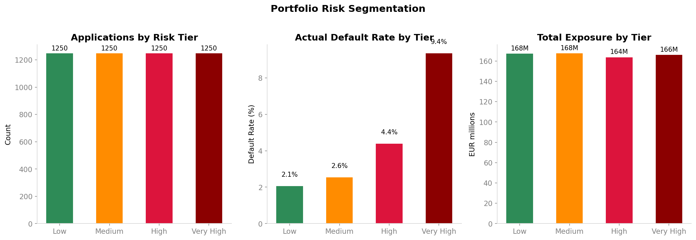
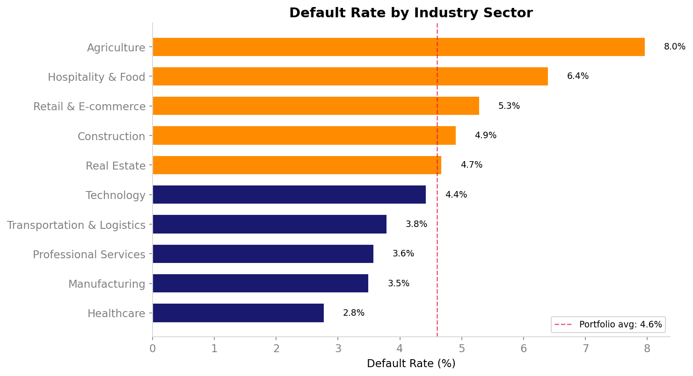
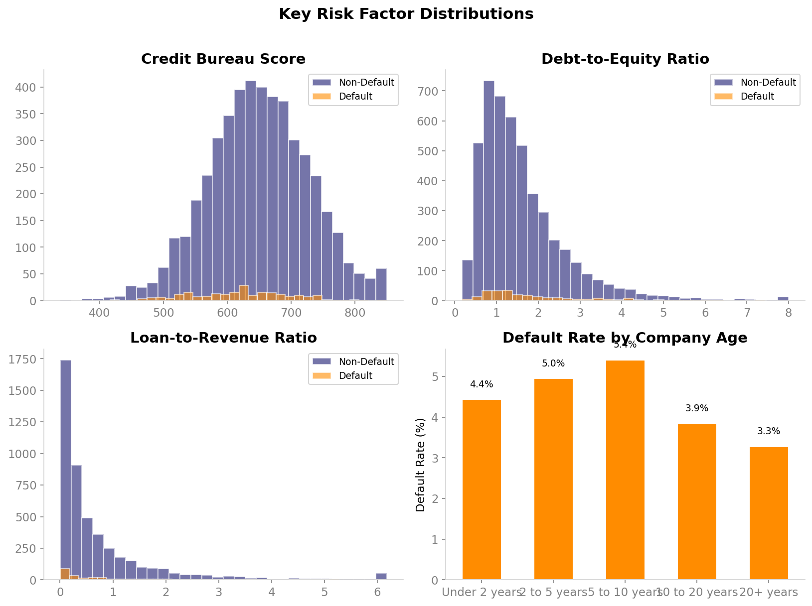
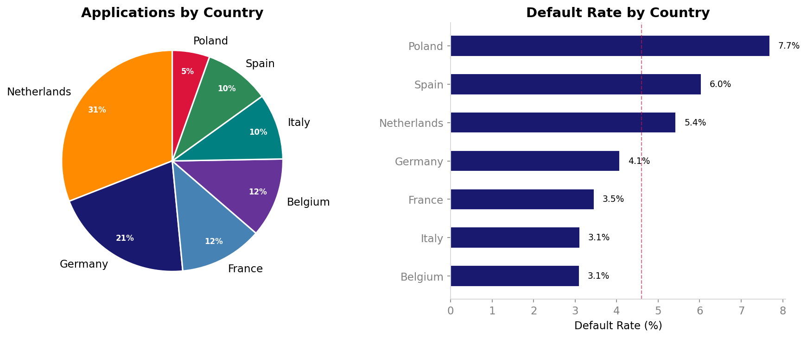
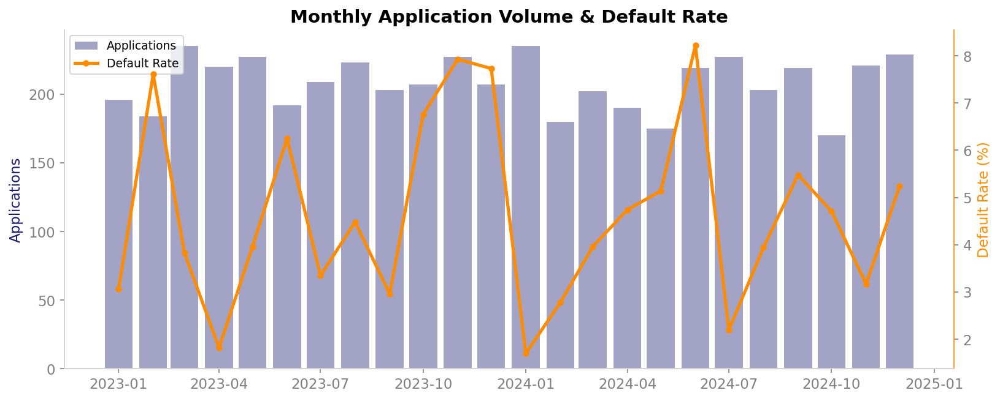

<p align="center">
  
</p>

# Credit Risk Scoring for SME Lending

**Reducing default losses through data-driven risk tiering across a EUR 666M European SME loan portfolio.**

---

### Overview

This project takes a portfolio of 5,000 European SME loan applications and builds an end-to-end credit risk pipeline: SQL-based exploratory analysis to understand default patterns, Python visualizations to map risk distributions, three ML models to predict default probability, and a risk tiering system that segments the portfolio into actionable buckets. The analysis reveals that sector, credit score, and existing client status are the strongest predictors, and recommends risk-adjusted pricing and fast-track approvals.

### The Problem

A European bank processes 5,000 SME loan applications annually across 7 countries and 10 sectors. Manual underwriting is slow and inconsistent, leading to avoidable defaults. The goal is to build a data-driven scoring system that segments applicants into risk tiers and supports faster, more accurate lending decisions.

### About the Data

This project uses **synthetic data** generated by [`generate_data.py`](src/generate_data.py), with parameters calibrated against real European banking statistics:

| Parameter | Value | Source |
|:---|:---|:---|
| Base default rate | 3.5% (annual flow) | EBA Risk Assessment Report 2024 |
| Company size split | 58% micro, 27% small, 15% medium | Eurostat Business Demography 2023 |
| Median loan size | ~EUR 130K | OECD Secured Lending 2022 |
| Collateral rate | 45% of loans secured | OECD Secured Lending 2022 |
| Existing client discount | 20% lower default | Academic lending research |
| Sector risk multipliers | Hospitality 1.5x, Healthcare 0.6x | EBA sector-level NPL data |
| Young firm penalty | 1.4x for firms under 3 years | Eurostat business survival rates |

The data covers 5,000 applications across 7 EU countries and 10 sectors over a 2-year period. Missing values (~3%) are injected in profit margin and revenue growth fields to simulate real-world data quality issues.

### The Approach

**Phase 1 - Explore the data with SQL**

Before building any models, I used SQL to map out the portfolio and identify where defaults concentrate. All 10 queries are in the [`sql/`](sql/) folder. Here is what I found:

#### Portfolio snapshot ([01_portfolio_overview.sql](sql/01_portfolio_overview.sql))

| Total Applications | Total Defaults | Default Rate | Avg Loan Amount | Total Exposure |
|:---:|:---:|:---:|:---:|:---:|
| 5,000 | 230 | 4.60% | EUR 133,145 | EUR 665,723,981 |

A 4.6% default rate on EUR 666M of exposure means roughly EUR 30M at risk annually.

#### Default rate by sector ([02_default_rate_by_sector.sql](sql/02_default_rate_by_sector.sql))

| Sector | Applications | Default Rate |
|:---|:---:|:---:|
| Agriculture | 276 | 7.97% |
| Hospitality & Food | 484 | 6.40% |
| Retail & E-commerce | 737 | 5.29% |
| Construction | 448 | 4.91% |
| Real Estate | 363 | 4.68% |
| Technology | 654 | 4.43% |
| Transportation & Logistics | 343 | 3.79% |
| Professional Services | 670 | 3.58% |
| Manufacturing | 629 | 3.50% |
| Healthcare | 396 | 2.78% |

Agriculture and Hospitality default at nearly 2x the portfolio average. Healthcare is the safest at under 3%.

#### Existing clients vs new applicants ([06_existing_client_advantage.sql](sql/06_existing_client_advantage.sql))

| Client Status | Applications | Default Rate |
|:---|:---:|:---:|
| Existing client | 1,983 | 3.88% |
| New applicant | 3,017 | 5.07% |

Existing clients default about 1.2 percentage points less, a meaningful 24% relative reduction.

#### Default rate by company age ([04_risk_by_company_age.sql](sql/04_risk_by_company_age.sql))

| Age Bucket | Applications | Default Rate |
|:---|:---:|:---:|
| Under 2 years | 248 | 4.44% |
| 2 to 5 years | 1,252 | 4.95% |
| 5 to 10 years | 1,646 | 5.41% |
| 10 to 20 years | 1,274 | 3.85% |
| 20+ years | 580 | 3.28% |

Companies with 10+ years in business default at 3.3-3.9%, compared to ~5% for younger firms.

#### Collateral impact by loan size ([07_collateral_impact.sql](sql/07_collateral_impact.sql))

| Loan Size | Without Collateral | With Collateral |
|:---|:---:|:---:|
| Under 50K | 5.96% | 3.24% |
| 50K to 150K | 5.11% | 3.66% |
| 150K to 500K | 6.44% | 3.01% |

Collateral cuts default rates nearly in half across all loan sizes.

#### Risk tier exposure ([10_risk_tier_exposure.sql](sql/10_risk_tier_exposure.sql))

| Tier | Applications | Default Rate | Avg Credit Score |
|:---|:---:|:---:|:---:|
| Low Risk | 1,250 | 2.88% | 750 |
| Moderate Risk | 1,250 | 4.00% | 674 |
| Elevated Risk | 1,250 | 4.88% | 623 |
| High Risk | 1,250 | 6.64% | 548 |

Default rate increases steadily from 2.9% in the best tier to 6.6% in the worst, validating the scoring approach.

**Phase 2 - Visualize patterns with Python**

Using the patterns from SQL, I built visualizations in [`analyze.py`](src/analyze.py) to explore correlations, distributions, and trends across the full feature set.

<table>
<tr>
<td width="50%"><br><sub>Default rates vary nearly 3x across sectors</sub></td>
<td width="50%"><br><sub>Clear separation in credit scores and leverage ratios</sub></td>
</tr>
<tr>
<td width="50%"><br><sub>Country-level risk patterns</sub></td>
<td width="50%"><br><sub>Monthly default trends over the portfolio period</sub></td>
</tr>
</table>

**Phase 3 - Train ML models for risk scoring**

I trained three classifiers to predict default probability. Credit Bureau Score, Payment Default History, and Debt-to-Equity Ratio emerged as the top risk drivers. The portfolio was segmented into 4 risk tiers based on predicted probabilities.

| Model | AUC-ROC |
|-------|---------|
| Logistic Regression | **0.64** |
| Random Forest | 0.64 |
| Gradient Boosting | 0.63 |

> With limited feature separation in synthetic data, all three models converge near 0.64 AUC. Logistic Regression was selected for its interpretability and equivalent performance.

**Phase 4 - Recommendations**

| Action | Expected Impact |
|--------|----------------|
| Risk-adjusted pricing by tier | +15 to 20 bps margin on high-risk loans |
| Tightened criteria for Hospitality & Agriculture | Reduce sector default rate by 25% |
| Fast-track approvals for low-risk existing clients | 40% reduction in underwriting time |
| Collateral requirement for Loan/Revenue > 50% | Lower loss-given-default by 30% |

### How to Read This Analysis

| File | What it does |
|------|-------------|
| [`generate_data.py`](src/generate_data.py) | Creates a synthetic dataset of 5,000 SME loan applications with realistic risk patterns |
| [`analyze.py`](src/analyze.py) | Loads the data, cleans it, creates all 9 visualizations, trains 3 ML models, and segments the portfolio into risk tiers |
| [`sql/`](sql/) | 10 PostgreSQL-compatible queries covering portfolio overview, sector risk, country risk, company age, high-risk filters, existing client advantage, collateral impact, monthly trends, sector-country matrix, and risk tier exposure |
| [`run.py`](run.py) | Runs the full pipeline end to end |
| [`style_config.py`](style_config.py) | Defines chart styling using matplotlib named colors and rcParams |

To run: `python run.py`

Note: Chart styling is defined in [`style_config.py`](style_config.py) using matplotlib named colors.

### Project Structure

```
credit-risk-scoring/
├── src/
│   ├── generate_data.py       # Synthetic data pipeline
│   └── analyze.py             # Full analysis + modeling pipeline
├── sql/                       # 10 PostgreSQL-compatible analysis queries
├── data/                      # Generated datasets
├── ./outputs/figures/           # All 9 visualizations
├── docs/
│   └── executive_brief.md
├── style_config.py            # Chart styling (matplotlib named colors + rcParams)
├── run.py
└── requirements.txt
```

---

<sub>Built by Sanjana</sub>
